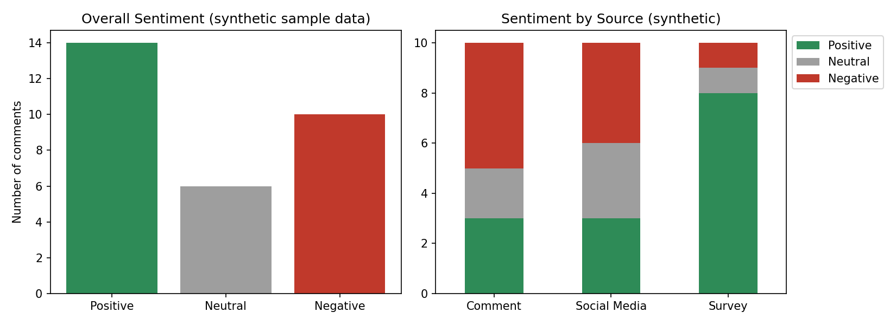

# Internship Feedback Sentiment Analysis (Task 7)

This project uses Python and NLTK's VADER to check the tone of internship feedback and label each comment as positive, neutral or negative.

**Note:** No dataset was given with this task, so I wrote 30 sample (synthetic) comments for practice, spread across three sources: survey, comment and social media. The results show how the method works. They are not real intern opinions.

## What the script does

1. Puts the feedback into a pandas DataFrame and checks for missing values.
2. Cleans the text by removing links, mentions and extra spaces.
3. Gets a VADER compound score (from -1 to +1) for each comment.
4. Labels each comment: 0.05 or above is positive, -0.05 or below is negative, anything in between is neutral.
5. Counts the labels overall and for each source, and shows the 5 most positive and 5 most negative comments.
6. Saves a chart (`sentiment_charts.png`) and the labeled data (`classified_feedback.csv`).

## How to run

```
pip install pandas matplotlib nltk
python internship_sentiment_analysis.py
```

The VADER word list downloads automatically the first time, so an internet connection is needed.

## Results (on the sample data)

Overall:

| Sentiment | Count | Percent |
| --- | --- | --- |
| Positive | 14 | 46.7% |
| Neutral | 6 | 20.0% |
| Negative | 10 | 33.3% |

By source:

| Source | Positive | Neutral | Negative |
| --- | --- | --- | --- |
| Survey | 8 | 1 | 1 |
| Comment | 3 | 2 | 5 |
| Social Media | 3 | 3 | 4 |



In this sample, survey comments were the most positive and the other two sources were more mixed. The negative comments mostly talked about unclear task instructions, missing datasets and a lack of mentor support. I wrote these comments myself, so this only shows what the analysis can find. It is not a real conclusion about any internship.

## Limitations

- The data is synthetic, so the numbers say nothing about a real internship.
- VADER is rule-based and not trained on internship feedback. It can miss sarcasm or context.
- A comment with both good and bad points still gets only one label.
- VADER scored "Communication was slow and I waited days for a reply" as neutral, even though it is a complaint. It does not understand every complaint.

## Files

- `internship_sentiment_analysis.py`: the code
- `sentiment_charts.png`: the charts
- `classified_feedback.csv`: the comments with scores and labels
